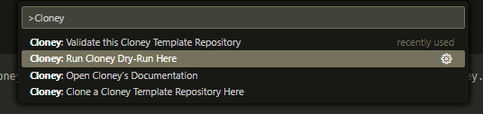

# Cloney

This extension provides enhanced support for the Cloney tool, making it easier to work with Cloney template repositories directly from within the Visual Studio Code environment.

 

  

 

## What is Cloney?

[Cloney](https://arthursudbrackibarra.github.io/cloney-documentation) is a versatile tool designed for cloning and creating dynamic template git repositories. With Cloney, you can define reusable templates with Go template syntax, making it a powerful solution for creating dynamic and adaptable projects.

## Features

- **Custom Icons:**

  - Provides custom icons for `.cloney.yaml` and `.cloney-vars` files.

    

- **Snippets and Autocompletion:**

  - Supports `.cloney.yaml` metadata file.

    

  - Supports `.cloney-vars` variables file.

    **Local Variables**:
    

    **Remote Variables**:
    

  - Provides partial autocompletion for Go template syntax.

    

- **Run Cloney Commands through VSCode UI:**

  - Execute Cloney commands (Clone, Dry-run, and Validate) via `F1` or `Ctrl + Shift + P`.

    

## Requirements

1. To use this extension, you need to have [Cloney](https://arthursudbrackibarra.github.io/cloney-documentation/getting-started/#installing-cloney) installed on your machine. If you haven't installed Cloney yet, the extension guides you to the installation page.

1. For the remote variables feature, you also need to have [Git](https://git-scm.com/downloads) installed on your machine.

## Extension Settings

This extension contributes the following settings:

- `cloney.cloneyExecutablePath`: (Optional) The absolute path to the Cloney executable.

## Release Notes

### 0.0.1

- Initial release.
- Added snippets and autocompletion for `.cloney.yaml` and `.cloney-vars` files.
- Implemented the ability to run Cloney commands through the VSCode UI.

### 0.0.2

- Fixed a dependency error that was preventing the extension from working.

## Contributing

If you find any issues or have suggestions, feel free to contribute or open an issue on [GitHub](https://github.com/ArthurSudbrackIbarra/cloney-vscode-extension).

## License

This extension is licensed under the MIT License - see the [LICENSE](LICENSE) file for details.
